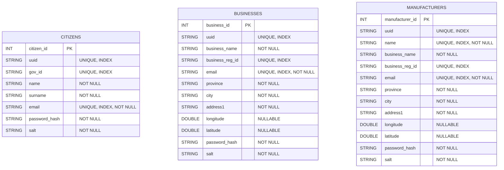

# Supply Chain ERD Documentation

Last updated: 2025-09-25

## Scope

This document describes the current relational data model (ERD) implemented with SQLAlchemy for the backend FastAPI service. The goal is to support a government-facing application that visualizes supply chains on a map (Google Maps API on the frontend). Transactional relationships and graph analytics will be modeled in Neo4j later and are intentionally not represented as foreign keys in this ERD.

## High-level overview

Current entities:
- Citizens
- Businesses
- Manufacturers

Notes:
- There are no explicit foreign keys between these tables yet. The `ForeignKey` import is unused, so the schema is intentionally de-coupled pending graph modeling in Neo4j.
- Each table includes identity and indexing columns for API-level correlation and search.
- Businesses and Manufacturers include geospatial coordinates (longitude, latitude) for map visualization.

## Entity details

### Citizens
Table name: `citizens`

Columns:
- `citizen_id` (PK, int, autoincrement)
- `uuid` (string, unique, indexed, nullable by default in SQLAlchemy unless specified; consider nullable=False)
- `gov_id` (string, unique, indexed)
- `name` (string, not null)
- `surname` (string, not null)
- `email` (string, unique, indexed, not null)
- `password_hash` (string, not null)
- `salt` (string, not null)

Indexes and constraints:
- Unique: `uuid`, `gov_id`, `email`
- Implicit index: `uuid`, `gov_id`, `email`

Remarks:
- Consider enforcing `uuid` as non-null to avoid multiple NULLs with a unique constraint (RDBMS-dependent behavior).

### Businesses
Table name: `businesses`

Columns:
- `business_id` (PK, int, autoincrement)
- `uuid` (string, unique, indexed)
- `business_name` (string, not null)
- `business_reg_id` (string, unique, indexed)
- `email` (string, unique, indexed, not null)
- `province` (string, not null)
- `city` (string, not null)
- `address1` (string, not null)
- `longitude` (double/float, nullable)
- `latitude` (double/float, nullable)
- `password_hash` (string, not null)
- `salt` (string, not null)

Indexes and constraints:
- Unique: `uuid`, `business_reg_id`, `email`
- Implicit index: `uuid`, `business_reg_id`, `email`

Remarks:
- Coordinates are optional; this allows records to be created before geocoding.

### Manufacturers
Table name: `manufacturers`

Columns:
- `manufacturer_id` (PK, int, autoincrement)
- `uuid` (string, unique, indexed)
- `name` (string, unique, indexed, not null)
- `business_name` (string, not null)
- `business_reg_id` (string, unique, indexed)
- `email` (string, unique, indexed, not null)
- `province` (string, not null)
- `city` (string, not null)
- `address1` (string, not null)
- `longitude` (double/float, nullable)
- `latitude` (double/float, nullable)
- `password_hash` (string, not null)
- `salt` (string, not null)

Indexes and constraints:
- Unique: `uuid`, `name`, `business_reg_id`, `email`
- Implicit index: `uuid`, `name`, `business_reg_id`, `email`

Remarks:
- Class name is plural (`Manufacturers`), but table name already pluralizes to `manufacturers`. Consider renaming the class to `Manufacturer` for conventional style (optional).

## ER diagram (Mermaid)



## How this supports the Google Maps UI

- Display markers for `businesses` and `manufacturers` using `(latitude, longitude)`.
- Use clustering on the client for dense areas; style markers by entity type (e.g., manufacturer vs. business).
- Filter and search by province/city/business name, leveraging the indexed columns (`province`, `city`, `business_name`, `name`).
- When Neo4j edges are available, dynamically draw polylines along a path between suppliers and buyers obtained from the graph queries (not enforced in SQL).

## Security and privacy

- Passwords are stored as `password_hash` + `salt`. Use a strong KDF (Argon2id or bcrypt with cost factor) and consider a server-side pepper.
- Ensure `email` is unique and verified at registration.
- Consider column-level encryption or field-level encryption for PII (e.g., `gov_id`).
- Audit logging for access to sensitive fields.

## Data quality and geocoding

- For accurate mapping, consider enforcing valid coordinate ranges: longitude ∈ [-180, 180], latitude ∈ [-90, 90].
- Optionally normalize and store addresses (`province`, `city`, `address1`) in reference tables if needed for data integrity and consistent filtering.
- If your target RDBMS supports it (e.g., PostGIS, MySQL Spatial), consider geospatial types for better indexing and distance queries. For now, simple numeric types are acceptable.

## Neo4j mapping plan (future)

The relational tables remain the authoritative store for core entities. Transactions, supply chain flows, and relationships live in Neo4j for flexible traversal and analytics.

Proposed graph schema (example):
- Nodes: `Citizen`, `Business`, `Manufacturer`, `Product`, `Transaction`, `Shipment` (extend as needed)
- Relationships:
  - `(:Manufacturer)-[:SUPPLIES]->(:Business)`
  - `(:Business)-[:SELLS_TO]->(:Citizen)`
  - `(:Transaction)-[:INVOLVES]->(:Business|:Manufacturer|:Citizen)`
  - `(:Shipment)-[:FROM]->(:Manufacturer)` and `(:Shipment)-[:TO]->(:Business)`

Key mappings:
- Carry over stable IDs (`uuid`, `email`, `business_reg_id`, `gov_id`) into node properties for upserts and reconciliation.
- Add location properties to nodes (`latitude`, `longitude`) to draw lines/paths on the map.

Example Cypher upsert patterns (pseudo):

```cypher
// Upsert Manufacturer
MERGE (m:Manufacturer { uuid: $uuid })
ON CREATE SET m.name = $name, m.email = $email,
              m.business_reg_id = $regId,
              m.latitude = $lat, m.longitude = $lng
ON MATCH SET  m.name = $name, m.email = $email,
              m.latitude = $lat, m.longitude = $lng;

// Upsert Business
MERGE (b:Business { uuid: $uuid })
ON CREATE SET b.business_name = $name, b.email = $email,
              b.business_reg_id = $regId,
              b.latitude = $lat, b.longitude = $lng
ON MATCH SET  b.business_name = $name, b.email = $email,
              b.latitude = $lat, b.longitude = $lng;

// Create/Upsert relationship when a transaction occurs
MATCH (m:Manufacturer { uuid: $manufacturerUuid })
MATCH (b:Business { uuid: $businessUuid })
MERGE (m)-[r:SUPPLIES]->(b)
ON CREATE SET r.first_seen_at = timestamp()
ON MATCH SET  r.last_seen_at = timestamp(), r.tx_count = coalesce(r.tx_count,0) + 1;
```

## Recommendations and next steps

Short-term improvements:
- Make `uuid` non-null across all tables (`nullable=False`) if intended as an external identifier.
- Add check constraints for coordinate ranges.
- Consider moving to a dedicated geospatial type/index if supported by your database.
- Use Alembic migrations to manage schema changes consistently.
- Rename class `Manufacturers` to `Manufacturer` for consistency (optional, breaking API risk if already in use).

Operational considerations:
- Seed geocoding pipeline to populate coordinates, or geocode on write.
- Add seed data and factories for testing (e.g., Faker-based generators).
- Establish data retention and PII handling policies.

Frontend alignment:
- Agree on JSON contracts for map endpoints (e.g., `/map/businesses`, `/map/manufacturers`), including filters and pagination.
- Define color/legend rules by entity and by edge type once graph data is available.

---
If you’d like, I can generate Alembic migrations and a small data seeding script next, plus stub endpoints for the map UI.